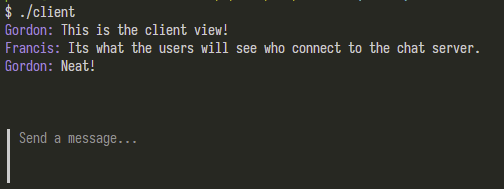
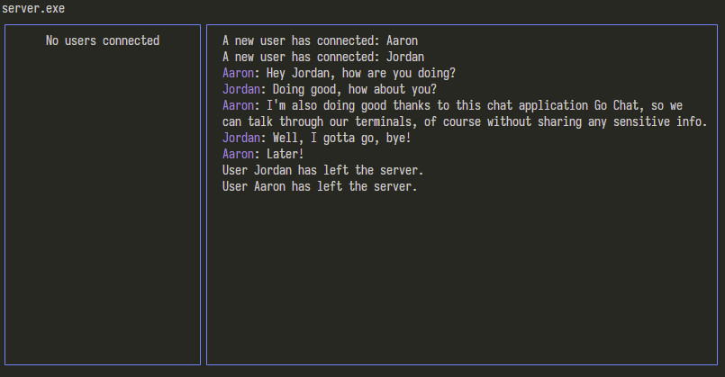

# Go Chat - UDP
Go Chat is a basic terminal chat application built using Golang. The app sends data using UDP protocols, meaning any data / messages sent should NOT INCLUDE SENSITIVE INFORMATION. The terminal UI is built using the Go Bubble Tea framework, and backend built using the default Go libraries.

## Table of contents
  - [Why Build This?](#why-build-this)
	

## Why Build This?
Realistically, this project shouldn't be used in favor of other general chatting services since it is based on UDP rather than TCP. UDP doesn't offer the same type of security that TCP does for the messages that users are sending. However, I was interested in UDP protocols since I wanted to learn more about game servers and how they transmit data. Since these serves favor UDP protocols, I decided to build a chat room based on UDP to learn more.
